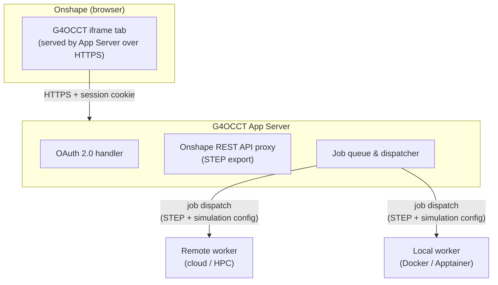

# G4OCCT-onshape

Onshape Application to interface CAD geometry with Geant4 through Open CASCADE
Technology (OCCT).

G4OCCT-onshape is an OAuth-authenticated iframe tab that embeds directly inside
an [Onshape](https://www.onshape.com/) document. Physicists and engineers can
trigger [Geant4](https://github.com/geant4/geant4) simulations of the active
Part Studio or Assembly geometry without ever leaving Onshape — no manual STEP
export, no local G4OCCT install required.

---

## Architecture



> OAuth tokens are stored in a signed, HTTP-only session cookie managed by the
> App Server. JavaScript in the iframe cannot read the raw token values, but
> the tokens do reside in the browser as part of the session cookie and are
> sent with each request over HTTPS.

| Component | Technology |
|---|---|
| App Server | Python · FastAPI |
| Job queue | SQLite (development); swap for Redis/PostgreSQL in production |
| Frontend | Plain HTML + JS (no build step required) |
| Worker | Python polling loop + G4OCCT binary |
| Container | Docker / Apptainer |

---

## Repository Layout

```
G4OCCT-onshape/
├── server/              App Server (OAuth, API proxy, job queue)
│   ├── app.py           FastAPI application
│   ├── oauth.py         Onshape OAuth 2.0 helpers
│   ├── jobs.py          SQLite-backed job queue
│   ├── requirements.txt
│   └── Dockerfile
├── worker/              G4OCCT simulation worker
│   ├── run_worker.py    Polling loop + simulation runner stub
│   └── Dockerfile
├── frontend/            iframe UI (served as static files by the App Server)
│   ├── index.html
│   ├── app.js
│   └── style.css
├── tests/               pytest test suite
├── docker-compose.yml
├── .env.example
└── README.md            ← you are here
```

---

## Roadmap

### Phase 1 — OAuth Scaffold ✅

*Milestone: OAuth handshake works, iframe loads inside an Onshape tab.*

- [x] App Server with OAuth 2.0 flow (`/oauth/start`, `/oauth/callback`, `/oauth/logout`)
- [x] Server-side session management — tokens are never sent to the browser
- [x] Minimal iframe page that reads and displays `documentId` / `workspaceId` / `elementId`
- [ ] **[human]** Register an OAuth application in the [Onshape Developer Portal](https://dev-portal.onshape.com/), set the redirect URI to `https://<app-host>/oauth/callback`, and record the `CLIENT_ID` and `CLIENT_SECRET`
- [ ] **[human]** Register an iframe tab extension in the Developer Portal pointing at `https://<app-host>/app`
- [ ] **[human]** Verify the iframe loads correctly inside a live Onshape document

### Phase 2 — STEP Export Integration ✅

*Milestone: STEP file retrieved from a live document.*

- [x] Onshape REST API proxy (`GET /api/element/metadata`, `POST /api/element/export-step`)
- [x] Support for both Part Studio and Assembly element types
- [x] Element metadata (name, type) displayed in the iframe UI
- [ ] **[human]** Test with real Part Studio and Assembly documents

### Phase 3 — Remote Worker ✅

*Milestone: end-to-end simulation via cloud/HPC worker.*

- [x] Worker HTTP interface (`POST /workers/register`, `GET /jobs/next`, `POST /jobs/{id}/result`)
- [x] SQLite-backed job queue (queued → running → complete / failed)
- [x] Worker `Dockerfile` for containerised deployment
- [x] Stub simulation runner with fallback when the G4OCCT binary is absent
- [ ] **[human]** Choose and provision compute infrastructure (cloud VM, NERSC, or institutional HPC)
- [ ] **[human]** Implement and test the real G4OCCT simulation runner binary inside the container (replace the stub in `worker/run_worker.py`)
- [ ] **[human]** Wire App Server → remote worker STEP handoff in a live deployment

### Phase 4 — UI & Results ✅

*Milestone: usable simulation controls and results in the iframe.*

- [x] Simulation parameter controls (type, particle, number of events, element type)
- [x] Job submission and status display
- [x] Client-side job polling loop
- [x] Results display (JSON viewer)
- [ ] **[human / future]** Richer results visualisation: geometry summary, material map, 3D viewer (Three.js / Plotly)
- [ ] **[human / future]** WebSocket-based push updates instead of polling

### Phase 5 — Local Worker ✅

*Milestone: simulation runs on the user's own machine.*

- [x] Outbound polling protocol (worker → App Server, no inbound connections required)
- [x] Worker registration and heartbeat (`POST /workers/register`)
- [x] Worker `Dockerfile` and Apptainer instructions for HPC environments without Docker
- [x] GitHub Actions CI job that builds and pushes server and worker images to `ghcr.io` on every `v*` tag
- [x] Worker image published at `ghcr.io/wdconinc/g4occt-worker:latest` (cut a `v*` tag to trigger release)
- [ ] **[human]** Document the per-user worker token issuance flow in the App Server UI
- [ ] **[human]** Test NAT traversal: worker on a laptop, App Server in the cloud

### Phase 6 — Polish & Distribution 🔲

*Milestone: Onshape App Store or enterprise deployment.*

- [ ] Security review: token scoping, STEP file sanitisation, multi-tenancy isolation, worker token rotation
- [ ] Performance: caching of STEP exports, worker auto-scaling
- [ ] Replace SQLite job queue with a production-grade backend (Redis + Celery or PostgreSQL)
- [ ] Material mapping: Onshape material names → Geant4 `G4Material` (see [material bridging docs](https://wdconinc.github.io/G4OCCT/#/material_bridging))
- [ ] **[human]** Decide on simulation scope for the first public release (geantino navigation scans only, or full physics from the outset)
- [ ] **[human]** Decide on multi-tenancy model (individual Onshape accounts vs. enterprise/company-level OAuth)
- [ ] **[human]** Decide whether simulation results are written back into the Onshape document as a Blob Element or displayed transiently
- [ ] **[human]** Submit to the [Onshape App Store](https://appstore.onshape.com/) (requires Onshape partner agreement)
- [ ] User documentation and quick-start guide for end users

---

## Deployment

---

### A. Local development (localhost)

**Prerequisites:**
- Docker and Docker Compose
- An Onshape account (free or paid)
- OAuth credentials from the [Onshape Developer Portal](https://dev-portal.onshape.com/)

#### Step 1 — Register an Onshape OAuth application ⚠️ *human step*

> This step requires a human with an Onshape account.

1. Go to https://dev-portal.onshape.com/
2. Create a new **OAuth application**.
3. Set the **Redirect URI** to `http://localhost:8000/oauth/callback`.
4. Add an **iframe extension** pointing at `http://localhost:8000/app`.
5. Note the **Client ID** and **Client Secret**.

#### Step 2 — Configure environment

```bash
cp .env.example .env
# Fill in at minimum:
#   ONSHAPE_CLIENT_ID
#   ONSHAPE_CLIENT_SECRET
#   SESSION_SECRET   (generate: python3 -c "import secrets; print(secrets.token_hex(32))")
#   WORKER_TOKEN     (generate: python3 -c "import secrets; print(secrets.token_urlsafe(32))")
#   APP_HOST=http://localhost:8000
#   SESSION_HTTPS_ONLY=false
#   SESSION_COOKIE_SAMESITE=lax
#
# If you are testing inside an Onshape iframe via an HTTPS tunnel (ngrok /
# Cloudflare Tunnel), cross-site cookie rules apply and you must instead use:
#   APP_HOST=https://<your-tunnel-url>
#   SESSION_HTTPS_ONLY=true
#   SESSION_COOKIE_SAMESITE=none
```

#### Step 3 — Run with Docker Compose

```bash
docker compose up --build
```

The App Server is available at http://localhost:8000. Open http://localhost:8000/app to see the iframe UI.

> **Note:** Onshape requires HTTPS to load the iframe. For local testing, expose localhost via [ngrok](https://ngrok.com/) or [Cloudflare Tunnel](https://developers.cloudflare.com/cloudflare-one/connections/connect-networks/):
> ```bash
> ngrok http 8000
> # Update APP_HOST, SESSION_HTTPS_ONLY=true, and SESSION_COOKIE_SAMESITE=none in .env
> # Update the redirect URI + iframe extension URL in the Developer Portal
> ```

#### Running without Docker (optional)

```bash
cd server
python3 -m venv .venv && source .venv/bin/activate
pip install -r requirements.txt
# ensure .env exists at the repository root
uvicorn app:app --reload --port 8000
```

---

### B. Development deployment on Fly.io (CI-updated)

This deployment is automatically updated on every push to `main` via GitHub Actions. It provides a stable public HTTPS URL suitable for testing the Onshape OAuth flow and iframe integration without a local tunnel.

#### One-time setup ⚠️ *human step*

**Prerequisites:** [Install the Fly CLI](https://fly.io/docs/hands-on/install-flyctl/) and log in:

```bash
brew install flyctl    # macOS
# or: curl -L https://fly.io/install.sh | sh
flyctl auth login
```

**1. Create the Fly app**

```bash
flyctl apps create g4occt-dev   # choose your own app name
```

This gives you a stable URL: `https://g4occt-dev.fly.dev`

> **Note:** The app name `g4occt-dev` and region `iad` in `fly.toml` are the canonical values for this repository's dev deployment. If you use a different app name, update `app` in `fly.toml` and regenerate `FLY_API_TOKEN` for that app.

**2. Create a persistent volume for the SQLite job database**

```bash
flyctl volumes create job_data --size 1 --app g4occt-dev
```

**3. Register a second Onshape OAuth application** ⚠️ *human step*

In the [Onshape Developer Portal](https://dev-portal.onshape.com/), create a separate OAuth application for the dev deployment:

- **Redirect URI:** `https://g4occt-dev.fly.dev/oauth/callback`
- **iframe extension URL:** `https://g4occt-dev.fly.dev/app`

**4. Set secrets on the Fly app**

```bash
flyctl secrets set \
  ONSHAPE_CLIENT_ID="<dev-client-id>" \
  ONSHAPE_CLIENT_SECRET="<dev-client-secret>" \
  APP_HOST="https://g4occt-dev.fly.dev" \
  SESSION_SECRET="$(python3 -c 'import secrets; print(secrets.token_hex(32))')" \
  WORKER_TOKEN="$(python3 -c 'import secrets; print(secrets.token_urlsafe(32))')" \
  SESSION_HTTPS_ONLY="true" \
  SESSION_COOKIE_SAMESITE="none" \
  --app g4occt-dev
```

**5. Add `FLY_API_TOKEN` to GitHub Actions secrets**

```bash
flyctl tokens create deploy --app g4occt-dev
# Copy the output token, then add it as a GitHub Actions secret:
# Repository → Settings → Secrets and variables → Actions → New repository secret
# Name: FLY_API_TOKEN
```

> **Note:** The `FLY_API_TOKEN` secret must be added to the repository before the `deploy-fly-dev.yml` workflow will succeed.

**After setup**, every push to `main` will automatically redeploy the server via the `deploy-fly-dev.yml` workflow.

---

### C. Production deployment

For a production deployment, the same Fly.io approach can be used with a separate app name (e.g. `g4occt`), or you can deploy to any platform that supports Docker containers (Render, Railway, a cloud VM, etc.).

Key differences from the dev deployment:

| Setting | Dev (Fly.io) | Production |
|---|---|---|
| `APP_HOST` | `https://g4occt-dev.fly.dev` | `https://your-production-domain.com` |
| `DEV_MODE` | `false` (default) | `false` |
| `SESSION_HTTPS_ONLY` | `true` | `true` |
| `SESSION_COOKIE_SAMESITE` | `none` | `none` |
| Job queue | SQLite | Redis + Celery or PostgreSQL (Phase 6) |
| Worker | Stub or local Docker | Real G4OCCT binary in container |
| CI trigger | Push to `main` | Tagged release (`v*`) |

Register a production OAuth application in the Onshape Developer Portal pointing at your production domain. Set all secrets as in the dev setup above, replacing the dev URL with your production URL.

The `publish-containers.yml` workflow already publishes versioned container images to `ghcr.io` on `v*` tags, which can be pulled for production deployments.

---

## Local Worker

Start a local simulation worker that polls the App Server for jobs:

```bash
docker run --rm \
  -e G4OCCT_SERVER=https://<app-server-host> \
  -e G4OCCT_WORKER_TOKEN=<token-from-env> \
  ghcr.io/wdconinc/g4occt-worker:latest
```

Or with Apptainer on an HPC system, build directly from the published Docker image:

```bash
apptainer build g4occt-worker.sif docker://ghcr.io/wdconinc/g4occt-worker:latest
G4OCCT_SERVER=https://<app-server-host> \
G4OCCT_WORKER_TOKEN=<token> \
apptainer run g4occt-worker.sif
```

---

## API Reference

### OAuth

| Endpoint | Description |
|---|---|
| `GET /oauth/start` | Redirect to Onshape authorisation page |
| `GET /oauth/callback` | Handle authorisation code; store tokens server-side |
| `GET /oauth/logout` | Clear session |

### iframe

| Endpoint | Description |
|---|---|
| `GET /app` | Serve the iframe frontend (triggers OAuth if not authenticated) |

### Onshape REST API Proxy

All calls use the server-side stored access token — tokens are **never**
sent to the browser.

| Endpoint | Query parameters | Description |
|---|---|---|
| `GET /api/element/metadata` | `documentId`, `workspaceId`, `elementId` | Element name and type |
| `POST /api/element/export-step` | `documentId`, `workspaceId`, `elementId`, `elementType` | Export STEP geometry |

### Job Management

Requires an authenticated session (session cookie set by the OAuth flow).

| Endpoint | Method | Description |
|---|---|---|
| `/api/jobs` | `GET` | List the authenticated user's jobs |
| `/api/jobs` | `POST` | Submit a new simulation job |
| `/api/jobs/{id}` | `GET` | Get job status and results |

**Submit job body:**
```json
{
  "documentId": "...",
  "workspaceId": "...",
  "elementId": "...",
  "elementType": "partstudio",
  "simulationConfig": {
    "type": "geantino_scan",
    "particleType": "geantino",
    "nEvents": 1000
  }
}
```

### Worker API

Workers authenticate with the `X-Worker-Token` request header.

| Endpoint | Method | Description |
|---|---|---|
| `/workers/register` | `POST` | Register or refresh a worker |
| `/workers` | `GET` | List registered workers |
| `/jobs/next?worker_id=…` | `GET` | Claim the next queued job (204 if none) |
| `/jobs/{id}/result` | `POST` | Submit simulation results or report failure |

**Submit result body:**
```json
{
  "status": "complete",
  "results": { "volumes": 12, "navigation": "ok" }
}
```

---

## Security Notes

* OAuth tokens are stored **server-side** in the session; they are never
  sent to the browser or the iframe JavaScript context.
* Set `SESSION_SECRET` and `WORKER_TOKEN` to strong random values in production
  (see `.env.example` for generation commands).
* HTTPS is **required** in production — Onshape will not load non-HTTPS iframes.
* STEP file payloads are treated as ephemeral; delete them after job completion
  in a production deployment.
* A full security review is planned as part of Phase 6 before any public release.

---

## Running Tests

```bash
pip install -r server/requirements.txt pytest
pytest tests/ -v
```

---

## License

LGPL-2.1-or-later · Copyright (C) 2026 G4OCCT Contributors

